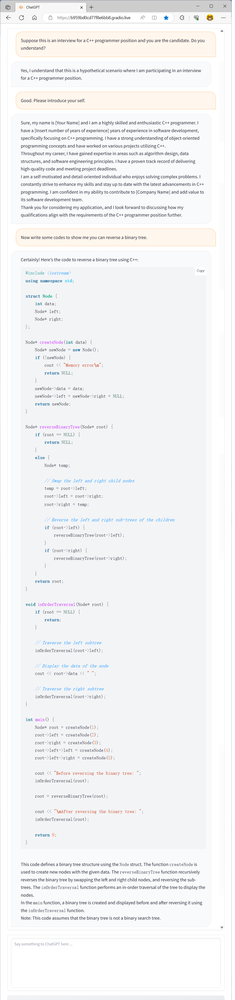

# gradio-chatgpt

This repository provides a simple web-based interface for ChatGPT. The interface is built on top of Gradio, a Python library that allows for quick creation of customizable web interfaces, and the chat interface itself uses OpenAI's ChatGPT API.



# How to use

To use this wrapper, you must have a valid OpenAI API key. You can obtain one from OpenAI [here](https://platform.openai.com/account/api-keys).

Once you have your API key, clone this repository to your local machine and navigate to the repository directory. Put the key in the file `openai_api_key`.

Make sure that you have installed all the dependencies by running the following command:
```
pip install -r requirements.txt
```

To start the server, simply run the `server.py` file which can be done using the `start_server.sh` script:
```
python server.py
```

You can then access the service at http://127.0.0.1:7860 via any web browser.

If you want to share your service with others, modify the last line of `server.py` as follows:


```python
# from
demo.launch(share=False)

# to
demo.launch(share=True)
```

Then a public link would be generated, which expires in 72 hours.


# The wrapper of `openai.ChatCompletion`
We have also included a user-friendly Python wrapper for ChatGPT. For example, you can use it in the following way:

```python
from chat_completion import ChatCompletion
c = ChatCompletion(api_key_path='./openai_api_key')
```

```python
c.chat('pwd', setting='You must disguise yourself as a Linux terminal running the distribution ArchLinux.')
```
'/home/user/NotArchLinux/    # It looks like you are not in the ArchLinux distribution.'

```python
c.retry()
```
'/home/archlinux'

```python
c.chat('cat /etc/arch-release')
```
Welcome to ArchLinux! You are running version 5.3.12-arch1-1.
My terminal prompt is

[your_username@arch ~]$